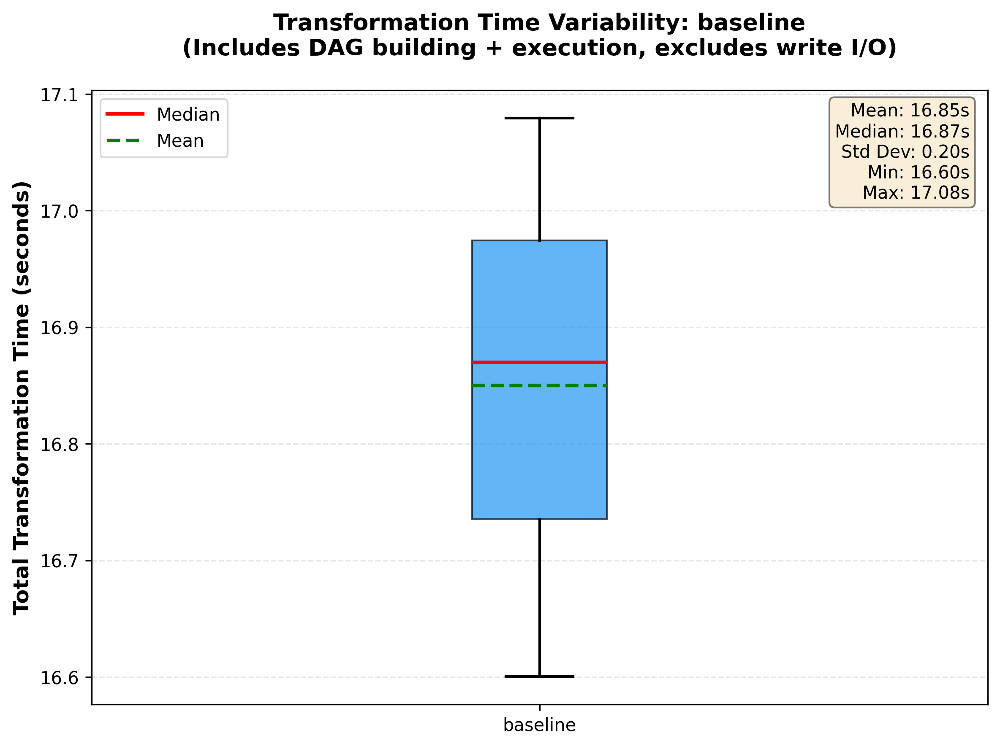
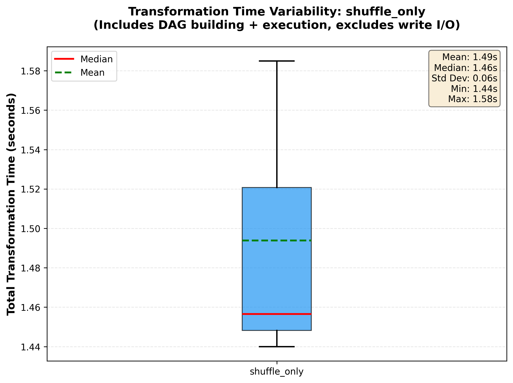
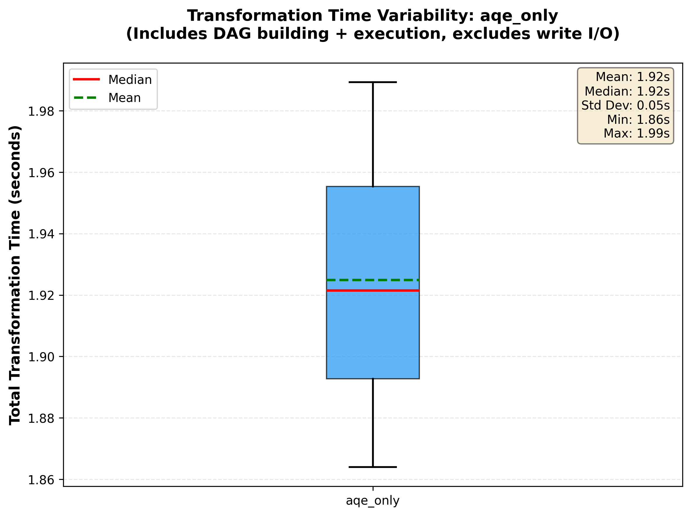
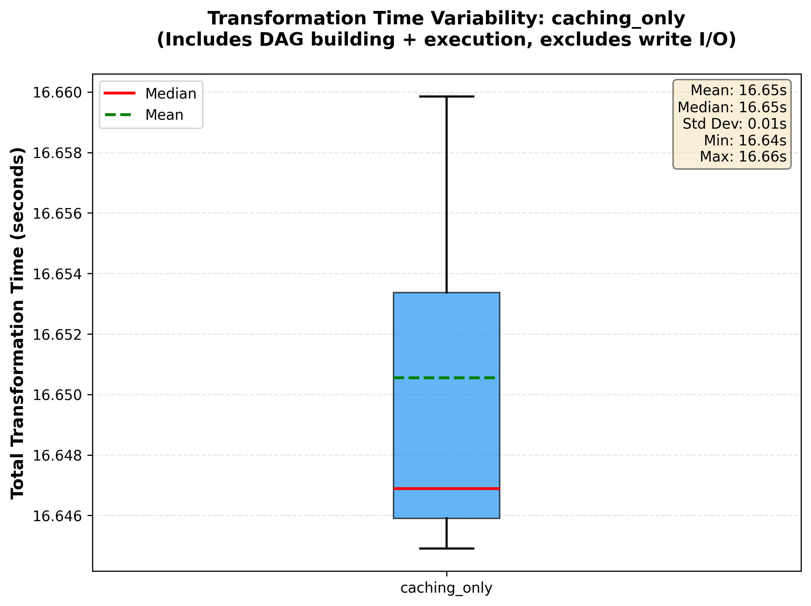
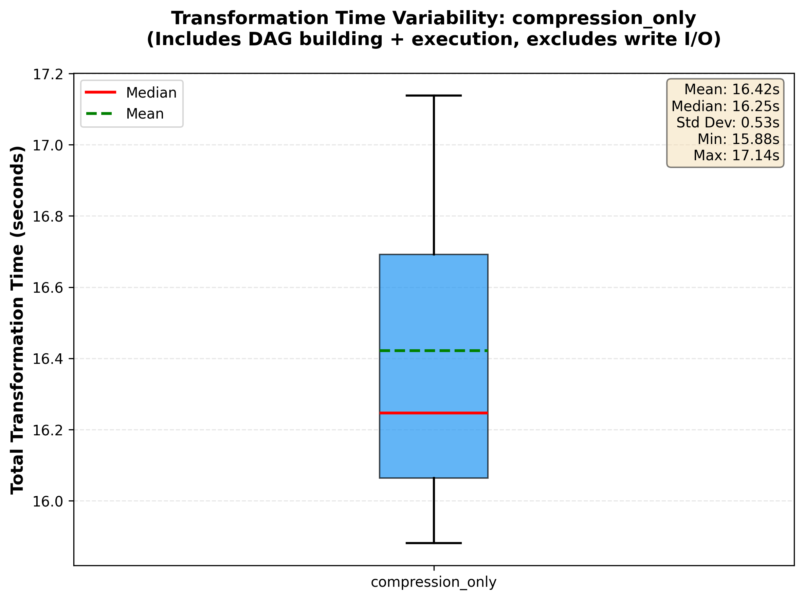
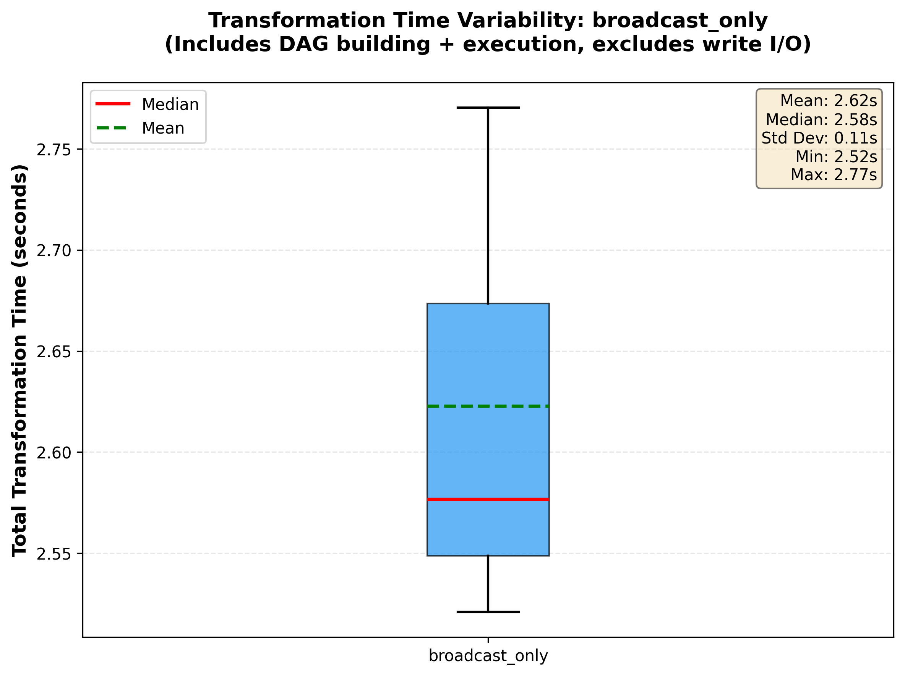
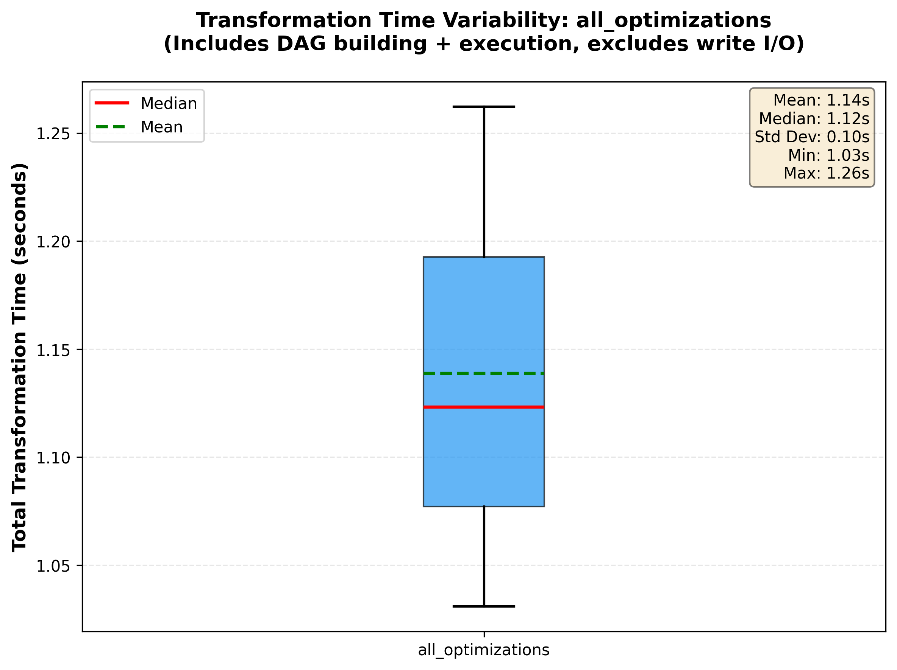
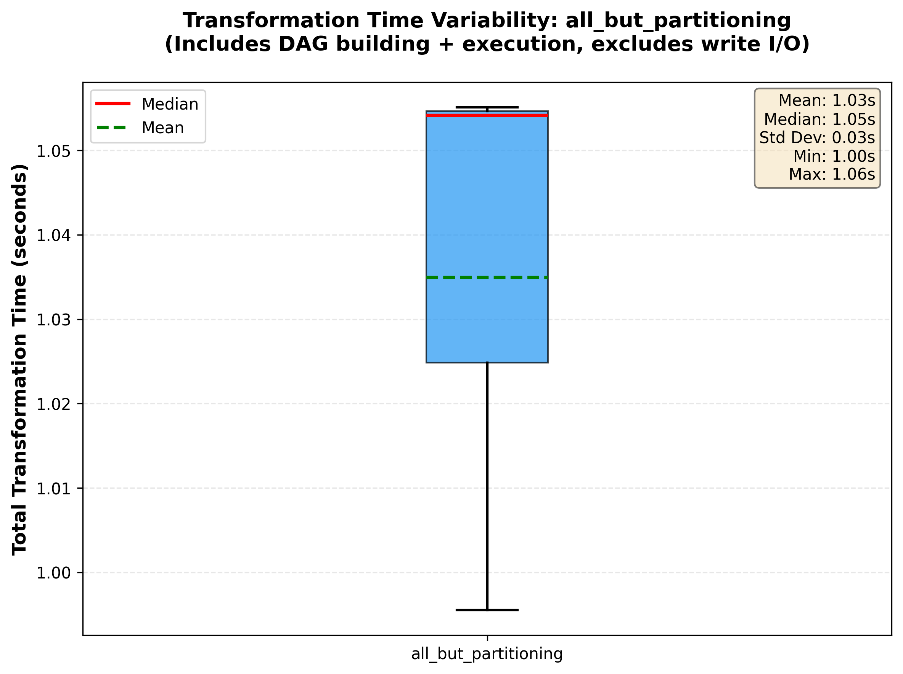
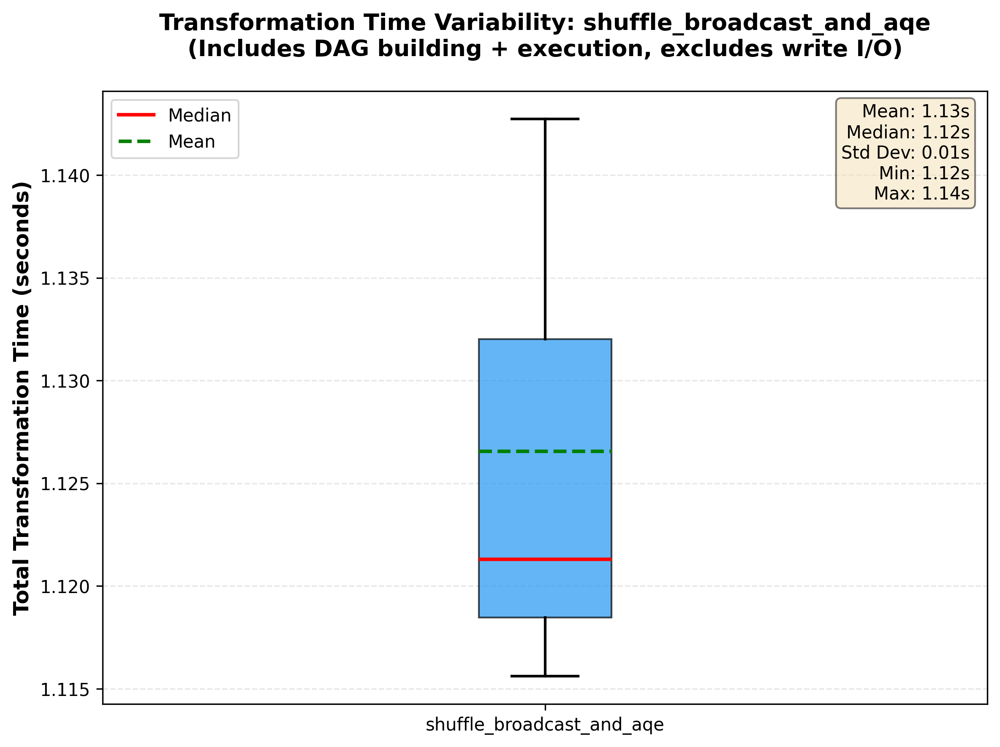

# Spark Optimization Performance Experiment Report

## Executive Summary
This report evaluates 10 Spark optimization strategies on a small-scale batch processing pipeline. The pipeline processes 10,000 users, 10,000 products, and 18,000 transactions through a medallion architecture (Bronze -> Silver -> Gold layers).

**Key Finding:** For small datasets, shuffle partition tuning and AQE provide significant performance improvements, while caching, compression, and partitioning show minimal impact due to dataset size.

## Test Environment
- **Dataset Size:** 10K users, 10K products, 18K transactions
- **Measurement:** Transformation time only (excludes disk I/O or spark startup)
- **Runs per Experiment:** 3 runs with averaging
- **Hardware:** Apple M1 Pro, 16GB RAM
- **PySpark Version:** 4.1.1

### **Experiment Results Summary**

The following table compares the transformation times (excluding data loading/saving I/O and Spark startup) across different configurations.

| Experiment | Avg Silver | Avg Gold | Avg Total Time | Min | Max | Std Dev |
| --- | --- | --- | --- | --- | --- | --- |
| **all_but_partitioning** | 0.51s | 0.53s | **1.03s** | 1.00s | 1.06s | 0.03s |
| **shuffle_broadcast_and_aqe** | 0.54s | 0.58s | **1.13s** | 1.12s | 1.14s | 0.01s |
| **all_optimizations** | 0.57s | 0.57s | **1.14s** | 1.03s | 1.26s | 0.10s |
| **shuffle_only** | 0.57s | 0.92s | **1.49s** | 1.44s | 1.58s | 0.06s |
| **aqe_only** | 0.74s | 1.19s | **1.92s** | 1.86s | 1.99s | 0.05s |
| **broadcast_only** | 0.71s | 1.91s | **2.62s** | 2.52s | 2.77s | 0.11s |
| **compression_only** | 3.53s | 12.89s | **16.42s** | 15.88s | 17.14s | 0.53s |
| **caching_only** | 3.41s | 13.24s | **16.65s** | 16.64s | 16.66s | 0.01s |
| **baseline** | 3.57s | 13.28s | **16.85s** | 16.60s | 17.08s | 0.20s |
| **partitioning_only** | 3.65s | 14.05s | **17.71s** | 17.36s | 18.13s | 0.32s |

### **Performance Improvements vs Baseline**

| Experiment | Times Faster | Time Savings |
| --- | --- | --- |
| **all_but_partitioning** | **16.28x** | **15.81s** |
| **shuffle_broadcast_and_aqe** | **14.96x** | **15.72s** |
| **all_optimizations** | **14.80x** | **15.71s** |
| **shuffle_only** | **11.28x** | **15.36s** |
| **aqe_only** | **8.75x** | **14.92s** |
| **broadcast_only** | **6.42x** | **14.23s** |
| **compression_only** | **1.03x** | **0.43s** |
| **caching_only** | **1.01x** | **0.20s** |
| **partitioning_only** | **0.95x** | **-0.86s** |

---

## Experiments Results Charts

### 1. Overall Performance Comparison

### 2. Speedup vs Baseline

### 3. Run-to-Run Variability Plots

#### Baseline Variability

#### Shuffle Only Variability

#### AQE Only Variability

#### Caching Only Variability
   

#### Compression Only Variability

#### Broadcast Only Variability

#### Partitioning Only Variability

#### All Optimizations Variability

#### All But Partitioning Variability

#### Shuffle, Broadcast, and AQE Variability

### 4. Silver vs Gold Layer Time Breakdown

## Key Findings and Conclusions

### 1. Best Overall Performance: All Optimizations Except Partitioning (16.28x faster)
The `all_but_partitioning` configuration achieved the best performance, reducing total time from 16.85s to 1.03s (16.28x faster). This demonstrates that partitioning can actually hurt performance on small datasets.

**Why it works:** 

Combining shuffle tuning, AQE, and broadcast joins without the overhead of partition management maximizes performance at this scale.
### 2. Shuffle + Broadcast + AQE: The Winning Combination (14.96x faster)
The `shuffle_broadcast_and_aqe` (with compression also, but it has nothing to do with transformation time) configuration achieved 14.96x speedup (1.13s total) with excellent consistency (std dev: 0.01s), showing these three optimizations work synergistically.

**Why these three matter:**

- Shuffle tuning eliminates task overhead
- Broadcast joins avoid expensive shuffles
- AQE dynamically optimizes based on runtime statistics

### 3. Shuffle Partitioning: Critical Foundation (11.28x faster)
Tuning `spark.sql.shuffle.partitions` from default **200** to **8** alone provides 11.28x speedup (1.49s). This is the single most impactful individual optimization.

**Why it matters:** For small datasets (10K–18K records), 200 partitions means:

- Each partition contains only ~50-90 records
- Task scheduling overhead exceeds actual processing time
- More time spent managing tasks than processing data

### 4. Adaptive Query Execution (AQE): Strong Individual Impact (8.75x faster)
Enabling AQE alone provides 8.75x speedup (1.92s) by optimizing execution plans dynamically based on actual data statistics.

**What AQE does:**

- Automatically coalesces shuffle partitions if data is smaller than expected
- Optimizes join strategies at runtime
- Handles data skew automatically

### 5. Broadcast Joins: Solid Gains (6.42x faster)
Auto-broadcast joins provided 6.42x speedup (2.62s) by avoiding expensive shuffles for small dimension tables.

**Why it helps:** Products and users tables (~10K rows each) are small enough to broadcast to all executors, eliminating the need for shuffle-based joins.

### 6. Minimal or Negative Impact at Current Scale
Caching, compression, and partitioning showed negligible or negative impact:

- **Compression (1.03x, +0.43s savings):** Minimal benefit since transformation time excludes I/O where compression helps most
- **Caching (1.01x, +0.20s savings):** Dataset fits in memory; no repeated disk reads to avoid
- **Partitioning (0.95x, -0.86s slower):** Partition management overhead exceeds benefits; actually slows down processing on small datasets
Here is the updated **Strategic Optimization Recommendations** section, replacing the serialization/Kryo focus with a deep dive into partitioning strategies based on industry best practices.

## **Strategic Optimization Recommendations**

While the experiment demonstrates that **Shuffle Partitioning** and **AQE** are the primary drivers for small-scale performance, scaling Spark for production workloads requires a multi-layered approach. Based on documentation from Apache Spark and Databricks, the following strategies are recommended for broader application:

### **1. Leverage Adaptive Query Execution (AQE)**

As seen in the results, AQE is a "low-effort, high-reward" feature. In modern Spark (3.2+), it should be enabled by default to handle runtime complexities that static planners cannot foresee.

* **General recommendation:** Ensure `spark.sql.adaptive.enabled` is set to `true`. It dynamically coalesces partitions, switches join strategies (e.g., from Sort-Merge to Broadcast), and optimizes skewed joins.
* **References:** 
  * [Apache Spark: Adaptive Query Execution](https://spark.apache.org/docs/latest/sql-performance-tuning.html#adaptive-query-execution)
  * [Databricks: Adaptive Query Execution - Speeding Up Spark SQL at Runtime](https://www.databricks.com/blog/2020/05/29/adaptive-query-execution-speeding-up-spark-sql-at-runtime.html)

### **2. Implement Smart Partitioning and Bucketing**

Partitioning is the most powerful tool for data skipping, but as your experiment showed, it must be applied at the correct scale to avoid overhead.

* **Partition Pruning:** Store data in a folder structure (e.g., `/year=2024/month=01/`) based on columns frequently used in `WHERE` clauses. This allows Spark to skip reading entire directories.
* **Ideal File Size:** Aim for file sizes between **128MB and 1GB**. Small files (the "Small File Problem") increase metadata overhead, while massive files limit parallelism.
* **Bucketing:** For very large tables frequently joined together, use **Bucketing** on the join key. This pre-shuffles the data, allowing Spark to perform "Sort-Merge Joins" without a runtime shuffle.
* **Salting for Skewed Data:** If certain keys are heavily skewed, consider salting those keys to distribute the load more evenly across partitions.
* **Select Appropriate Partition Columns:** Choosing the best partition column is an important step in optimizing the performance of your data processing:
  * **Medium Cardinality:** Choose columns with medium cardinality (a moderate number of unique values) to ensure even data distribution. However, avoid columns with too many unique values that could lead to small files, e.g., user IDs.
  * **Query Patterns:** Analyze your query patterns to identify columns frequently used in filters or joins. Partitioning on these columns can significantly reduce the amount of data scanned.
  * **Data Growth:** Consider how your data will grow over time. Partitioning on time-based columns (e.g., date, month, year) is often effective for time-series data.
  * **File Sizes per Partition:** Monitor the size of files generated in each partition. Aim for a balance where partitions are neither too small (leading to many small files) nor too large (causing processing bottlenecks).
* **Optimal Number of Partitions:** 
  - **Rule of thumb:** 2-3x available CPU cores for large datasets; reduce for small datasets (<100MB) to avoid task overhead.
  - **Key factors:** Executor memory (prevent OOM - Out Of Memory), task duration (lighter tasks = fewer partitions), and data skew (salt heavily skewed keys).
  - **Data distribution:** Ensure even distribution across partitions. For skewed keys, normalize data or split into sub-keys before merging results.
* **References:** 
  * [Databricks: Partitioning and Bucketing Best Practices](https://docs.databricks.com/en/tables/partitions.html)
  * [Talend: Introduction to Apache Spark Partitioning](https://www.talend.com/resources/intro-apache-spark-partitioning/)
  * [Salesforce: How to Optimize Your Apache Spark Application with Partitions](https://engineering.salesforce.com/how-to-optimize-your-apache-spark-application-with-partitions-257f2c1bb414/)
  * [Medium: Deep Dive into Spark Partitioning](https://medium.com/@krishnasai.itla/deep-dive-into-spark-partitioning-1d6f93ff640c)
  * [Singdata: Best Partitioning Strategies for Spark DataFrames on Amazon S3](https://www.singdata.com/trending/best-partitioning-strategies-spark-dataframes-amazon-s3/)

### **3. Manage Shuffle Partitions Dynamically**

The experiment proved that the default `spark.sql.shuffle.partitions = 200` is often detrimental for small datasets.

* **General recommendation:** For small datasets, lower this value (e.g., 8–20). For large datasets, a common rule of thumb is to set it to **2-3x the number of available CPU cores**.
* **Manual vs. Auto:** Use `df.coalesce(n)` to reduce partitions efficiently (it avoids a full shuffle) or `df.repartition(n)` if you need to re-balance data across the cluster for better parallelism.
* **References:** 
  * [Spark Tuning: Setting the Right Number of Partitions](https://spark.apache.org/docs/latest/sql-performance-tuning.html#tuning-partitions)
  * [Shuffling in Spark: How to Balance](https://bitsofchris.com/p/shuffling-in-spark-how-to-balance)

### **4. Maximize Broadcast Joins**

The "Broadcast Only" experiment yielded a 6.42x speedup. This remains the most effective way to eliminate shuffles.

* **General recommendation:** Explicitly use the `broadcast()` hint when joining a large "Fact" table with a small "Dimension" table (by default < 10MB).
* **Configuration:** Adjust `spark.sql.autoBroadcastJoinThreshold` to match your executor memory limits.
* **Advantages:** 
  * No shuffle needed → Saves time and network I/O
  * Massively faster for joins involving small tables
  * Ideal for lookup tables (like countries, states, categories)
* **When to avoid:**
  * **Table is Too Large** - If the "small" table isn’t actually small (say >10MB or so), broadcasting it can cause workers to run out of memory, leading to crashes.

  * **Data Skew in the Large Table** - If the large table has heavily skewed keys (some keys appear far more often than others), broadcast joins won't fix the imbalance, and certain partitions will become bottlenecks.
  
  * **Memory Duplication Overhead** - Every worker gets a full copy of the broadcasted table. If you have many nodes or many concurrent joins happening, the memory cost adds up fast.
* **References:** 
  * [Spark SQL: Join Hints](https://spark.apache.org/docs/latest/sql-ref-syntax-qry-select-hints.html#join-hints)
  * [How Broadcast Joins Work in Spark](https://deprep.substack.com/p/how-broadcast-joins-work-in-spark)

---

### **5. Caching Data Strategically**

While caching showed minimal benefit in this small-scale test, it is crucial for iterative algorithms and repeated reads in larger workloads.

* **General recommendation:** Caching data can help reduce shuffles in the following scenarios:

    * When your DataFrame will be used in multiple joins but with different tables

    * When you are performing multiple transformations on filtered data

    * In general, to cache some intermediate result that will be used downstream
* **Choose the right storage level:** Use `MEMORY_AND_DISK` for large datasets that may not fit entirely in memory. `MEMORY_ONLY` is for smaller datasets that fit comfortably within the executor memory. This option avoids disk spill but may result in recomputation if memory limits are reached.
* **References:** 
  * [Spark SQL: Caching Data](https://spark.apache.org/docs/latest/sql-performance-tuning.html#caching-data)
  * [Shuffling in Spark: How to Balance](https://bitsofchris.com/p/shuffling-in-spark-how-to-balance)
  * [Explaining the Mechanics of Spark Caching](https://luminousmen.com/post/explaining-the-mechanics-of-spark-caching/)