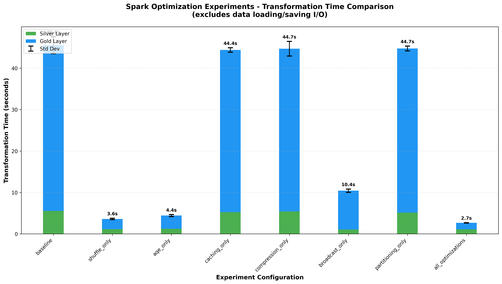
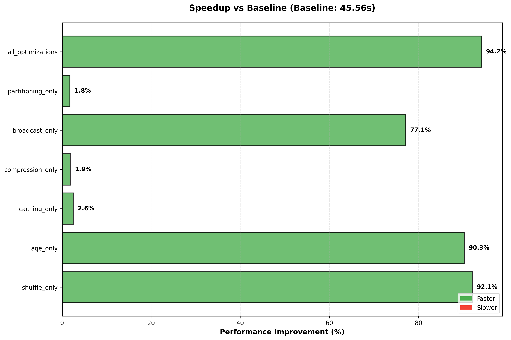
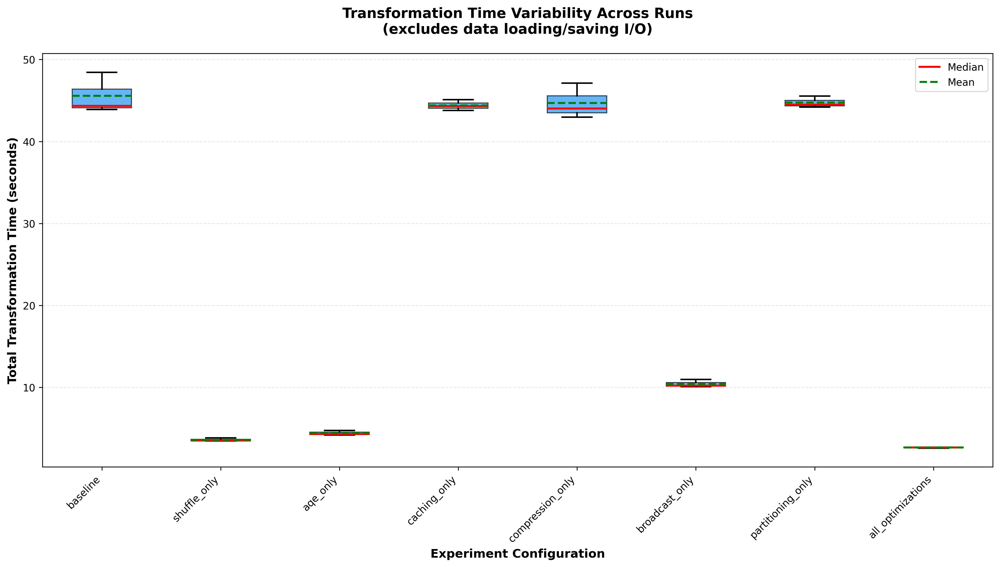
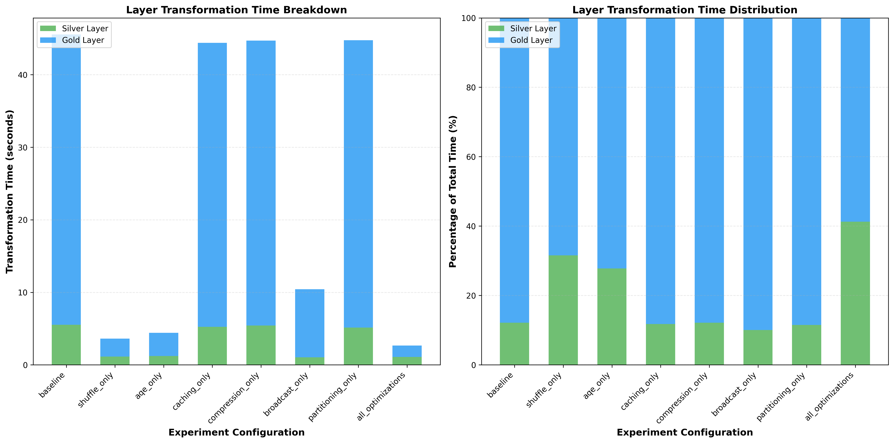

# Spark Optimization Performance Experiment Report

## Executive Summary
This report evaluates 8 Spark optimization strategies on a small-scale batch processing pipeline. The pipeline processes 10,000 users, 10,000 products, and 18,000 transactions through a medallion architecture (Bronze -> Silver -> Gold layers).

**Key Finding:** For small datasets, shuffle partition tuning and AQE provide 90%+ performance improvements, while caching, compression, and partitioning show minimal impact (<3%) due to dataset size.

## Test Environment
- **Dataset Size:** 10K users, 10K products, 18K transactions
- **Measurement:** Transformation time only (excludes disk I/O)
- **Runs per Experiment:** 3 runs with averaging
- **Hardware:** Apple M1 Pro, 16GB RAM
- **PySpark Version:** 4.1.1

### **Experiment Results Summary**

The following table compares the transformation times (excluding data loading/saving I/O) across eight different configurations.

| Experiment | Avg Silver | Avg Gold | Avg Total Time | Performance vs Baseline | Times Faster |
| --- | --- | --- | --- | --- | --- |
| **All Optimizations** | 1.10s | 1.56s | **2.66s** | **94.15% faster** | **17.1x** |
| **Shuffle Only** | 1.14s | 2.47s | **3.61s** | **92.08% faster** | **12.6x** |
| **AQE Only** | 1.23s | 3.20s | **4.43s** | **90.28% faster** | **10.3x** |
| **Broadcast Only** | 1.05s | 9.38s | **10.42s** | **77.12% faster** | **4.4x** |
| **Caching Only** | 5.24s | 39.16s | **44.39s** | **2.55% faster** | **1.03x** |
| **Compression Only** | 5.42s | 39.28s | **44.70s** | **1.88% faster** | **1.02x** |
| **Partitioning Only** | 5.14s | 39.61s | **44.75s** | **1.78% faster** | **1.01x** |
| **Baseline** | 5.53s | 40.02s | **45.56s** | *Reference* | *Reference* |

---

## Experiments Results Charts

### 1. Overall Performance Comparison

### 2. Speedup vs Baseline

### 3. Run-to-Run Variability

### 4. Silver vs Gold Layer Time Breakdown

### **Key Conclusions**

#### 1. **Shuffle Partitioning: The Foundation (92% improvement)**
Tuning `spark.sql.shuffle.partitions` from default **200** to **8** was the single most impactful change, reducing total time from ~45s to ~3.6s (92% improvement, 12.6x faster).

**Why it matters:** For small datasets (10K–18K records), 200 partitions means:
- Each partition contains only ~50-90 records
- Task scheduling overhead exceeds actual processing time
- More time spent managing tasks than processing data

#### 2. **Adaptive Query Execution (AQE): Runtime Intelligence (90% improvement)**
Enabling AQE (by default it is **enabled**) allows Spark to optimize execution plans dynamically based on actual data statistics, providing a 90% improvement (10.3x faster).

**What AQE does:**
- Automatically coalesces shuffle partitions if data is smaller than expected
- Optimizes join strategies at runtime
- Handles data skew automatically

#### 3. **Broadcast Joins: Medium Impact (77% improvement)**
Auto-broadcast joins provided a 77% improvement (4.4x faster) by avoiding expensive shuffles for small dimension tables.

**Why it helps:** Products and users tables (~10K rows each) are small enough to broadcast to all executors, eliminating the need for shuffle-based joins.

#### 4. **Cumulative Power: All Optimizations (94% improvement)**
Combining all optimizations resulted in the best performance (2.66s, 17.1x faster), demonstrating that optimizations compound effectively.

#### 5. **Minimal Impact at Current Scale**
Caching, compression, and partitioning showed minor gains (1.7%–2.5% improvement):

- **Caching (2.55%):** Dataset fits in memory; no repeated disk reads to avoid
- **Compression (1.88%):** Transformation time excludes I/O where compression helps most. To see benefits, we need to look at overall job time including read/write and check space savings.
- **Partitioning (1.78%):** Entire dataset smaller than typical partition; pruning overhead > benefits

### **Note about Partitioning Strategy**

#### **Current Results (1.78% improvement)**
At 10K products across 8 categories, each partition contains only ~1,250 products. This is too small to see meaningful benefits from partition pruning.

Partitioning may be more beneficial at larger scales (100K+ products) where partitions hold more data.

#### **Partitioning Recommendations by Table**

| Table | Partition By | Why | When to Apply |
|-------|-------------|-----|---------------|
| **transactions** | `transaction_date` (YYYY-MM) | Most queries filter by date range | >1M transactions |
| **users** | `country` | Geographic analysis common | >1M users |
| **products** | `category` | Category-based analysis  | >100K products |

#### **Avoiding Common Pitfalls**

❌ **Don't Over-Partition**
- Partitioning by high-cardinality columns (e.g., `product_id`) creates the "Small File Problem"

❌ **Don't Partition Small Tables**
- Tables under 100K rows rarely benefit
- Overhead of managing partitions > time saved

✅ **Do Partition on Low-Cardinality Filtered Columns**
- 5-100 unique values ideal
- Columns frequently in WHERE, JOIN, or GROUP BY clauses
- Geographic, categorical, or date fields